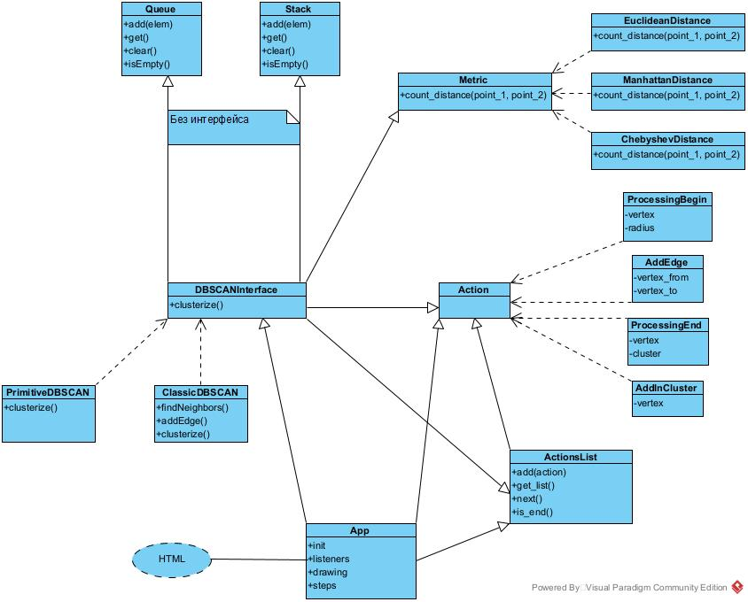

# Техническое описание проекта
Так как проект является визуализатором работы алгоритма, он разделён на две части: реализацию алгоритма и всего для него необходимого (внутренняя логика) и внешнюю часть в виде HTML-страницы и скрипта. Весь код написан на JS и работает на стороне пользователя (фронтед).

Вместо конкретных методов у класса App, отвечающего за работу web-страницы, описаны блоки методов (по функционалу), так как класс получился огромным.

## Внутренняя логика

### Метрики (модуль metrics)

Класс Metric является интерфейсом метрики вычисления расстояния между двумя точками (точки реализуются как списки координат) через единственный метод count_distance. Его имплементируют соответствующие классы-наследники для Евклидовой, Манхэттенской и Чебышёвой метрик.

### Действия (модуль actions)

Чтобы отслеживать порядок действий алгоритмов, необходимо их сохранять. Для этого создан класс ActionsList (по сути, очередь), хранящий все действия алгоритма (алгоритм сам их туда добавляет) - объекты класса Action (по замыслу, это структуры). Их  четыре:
*  ProcessingBegin - начало обработки вершины (поиск соседей и их добавление в кластер)
* AddEdge - соединить вершину с найденным соседом
* AddInCluster - добавление вершины в кластер
* ProcessingEnd - окончание обработки вершины

### Алгоритм (модуль DBSCAN)

В проекте у нас две реализации алгоритма: упрощённая (только параметр eps) и полноценная (оба параметра: eps и min_points). Каждая реализация - класс, имплементирующий интерфейс DBSCANInterface. При кластеризации они возвращают не только результат работы, но и список действий (ActionsList).

## Интерфейс

Сам интерфейс - web-страница interface2.html на HTML. К ней подключен скрипт index2.js. Класс App в нём создаёт лисенеры для всех объектов страницы. Функционал можно разделить на несколько частей:

- Параметры алгоритма: метрика расстояния, реализация алгоритма, контейнер для перебора вершин кластера и сами параметры - списки выбора одного варианта из нескольких на странице, которые при запуске кластеризации берёт скрипт и передаёт в алгоритм (модуль DBSCAN).
- Пошаговое управление: кнопки и соответствующие им методы, перезапускающие кластеризацию и позволяющие в ручную перемещаться по ActionsList.
- Инструменты, Настройка визуализации и тег canvas: с их помощью осуществляется и настраивается отрисовка, добавляются и удаляются вершины на канвасе (с помощью щелчка мыши).
- Примеры датасетов: готовые датасеты, хранящиеся в файле datasets_2.json и загружающиеся на канвас по нажатию соответствующих кнопок.

Файлы insex.js и interface.js - более ранние MVP приложения.
